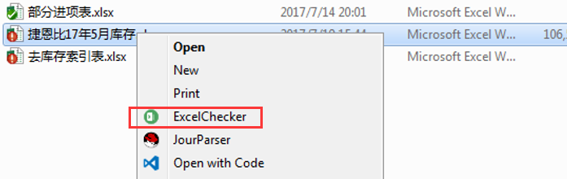

# 使用步骤
### 安装
鼠标右键点击“ExcelChecker.exe”，选择以管理员权限运行；（只需一次）

在安装完成后，会在“ExcelChecker.exe”同级目录下生成一个空文件“enabled”,代表安装成功。
### 使用
选择一个要检查的Excel表格邮件，选择“ExcelChecker”，开始检查修正Excel表格。

# 使用示例

# 注意事项
* 待检查的Excel文件目录下必须同时存在product.db文件，否则无法检查；
* ExcelChecker.exe 最好放在全英文路径下；
* ExcelChecker.exe如果更换目录，需删除‘enabled’文件，并重新执行安装步骤；
* 该工具只能检查名字中带有关键字的文件，关键字的优先级是，“进项”，“索引”，“库存”。
* 对于文件中的无效字符，工具不做特殊处理，如果想当成空处理，请主动清除。比如：
    * 未指定...
    * 暂时没有
    * NO NAME
    * 数量多减去点
    * 这个报关单有搞错
    * 等等
* 销售成本不在工具中计算，用Excel公式格式化即可：
    * 销售成本=IF(D6+F6=0,0,IF(D6+F6-H6=0,E6+G6,ROUND(H6*((E6+G6)/(D6+F6)),2)))
      * 注意当除数为0，结果直接置0，不知道是否满足要求
* 工具写死了各关键字所在的列编号，如果需要调整，需要修改代码。

